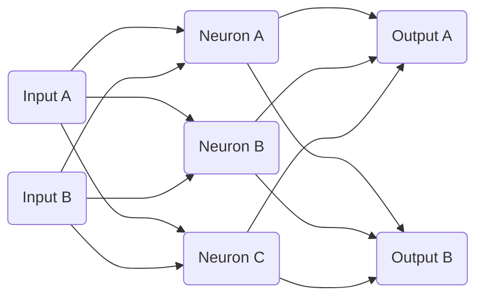

# Basic MLP Example for Lossless
## Prerequisites
1. Download the latest version of Go [here](https://go.dev/dl/).
2. Create your project directory, and run `go mod init [your project name]`
3. Run `go get github.com/EganBoschCodes/lossless`
## Creating your First Network
Let's begin with the basics. We will be creating an MLP (or multi-level perceptron), which will take in an array of float inputs representing some kind of data, and output a list of floats representing how sure we are that it belongs to a certain category.

It will be similar to the basic MLP structure above, but instead of having 3 neurons in the hidden layer (the one between the inputs and outputs) and 2 outputs, we will have 7 neurons in the hidden layer and 3 outputs. Why? The toy dataset we will be working on has 2 inputs and 3 outputs, and having a few extra neurons in the hidden layer usually helps.

### The Network Initialization
First, we have to build the network. This is a Multi-Layer Perceptron, so we will use the networks.Perceptron class.
```Go
import "github.com/EganBoschCodes/lossless/neuralnetworks/networks"

func  main() {
	mlp := networks.Perceptron{}
}
```
Now we have to specify the shape of the network. To do this, we will call the Initialize method of our MLP. The first argument is the size of the input vector, and then we pass the method all the layers we will be using. Let's use hyperbolic tangent, or `tanh`, as our activation function after our first layer, and `softmax` for the outputs, as is standard for classification.

If you are curious why we use `tanh` and `softmax`, I recommend reading up on the concept of activation functions, and why `softmax` is so good for classification work. The gist of it is that `tanh` maps all real numbers to being between -1 and 1, and introduces some non-linearity into our network to allow it to model non-linear behavior. `softmax` takes in a list of numbers and will produce a list of numbers summing to one and prioritizing the largest input, which means we can interpret the outputs of `softmax` layer like probabilities that the input is in said category.
```Go
import (
	"github.com/EganBoschCodes/lossless/neuralnetworks/networks"
	"github.com/EganBoschCodes/lossless/neuralnetworks/layers"
)

func  main() {
	mlp := networks.Perceptron{}
	mlp.Initialize(2,
		&layers.LinearLayer{Outputs: 7},
		&layers.TanhLayer{},
		&layers.LinearLayer{Outputs: 3},
		&layers.SoftmaxLayer{},
	)
}
```
Just like that, we have our perceptron set up. There are still some parameters that you can tweak, such as batch size and learning rate.
```Go
func  main() {
	mlp := networks.Perceptron{}
	...
	mlp.BatchSize = 32
	mlp.LearningRate = 0.05
}
```
Now all we need is a dataset!
### Datasets in Lossless
In lossless, networks train on arrays of `datasets.DataPoint`. This is a super simple struct, containing two `[]float64` properties: one called Input, the other Output. We can make our own datapoint very simply.
```Go
func  main() {
	...
	pointA := datasets.DataPoint{
		Input: []float64{0, 1},
		Output: []float64{1, 0},
	}
}
```
Go about doing this however you want to, create a toy dataset if you'd like, but create a number of DataPoints and stick them all in an array.
```Go
func  main() {
	...
	var myDataset []datasets.DataPoint
	myDataset = MyDatasetGenerationFunction()
}
```
In our example program, you will a function that creates a kind of three-armed spiral as our dataset, where the x and y are the inputs, and which arm of the spiral our point is in is the output. The function I used is titled `GetSpiralDataset()`.

Now, we have to separate our data into training and testing data; this is very important, and if you would like to learn why, look up "overfitting" and separation of testing and training data.
```Go
func  main() {
	...
	trainingData, testData := myDataset[:120], myDataset[120:]
}
```
Now we have everything we need to actually train our network!
### Training the MLP
Now, this is the easiest part! Simply call the Train method of the MLP, specifying your training data, test data, and how long you want it to train for.
```Go
func  main() {
	...
	mlp.Train(trainingData, testData, 10*time.Second)
}
```
And exactly as expected, your network will train for 10 seconds! It will let you know how good the random baseline was in terms of loss and correct categorization on your test data, give you a progress bar for training, then tell you how the network performs on the test data at the end. It will look a little something like:
```bash
Beginning Loss: 15.956
Correct Guesses: 26/51 (50.98%)

Training Progress : -{▒▒▒▒▒▒▒▒▒▒▒▒▒▒▒▒▒▒▒▒}- (100.0%)  
Final Loss: 0.000
Correct Guesses: 51/51 (100.00%)

Trained Epochs: 22239, Trained Datapoints: 2668704
```

So now your network is trained! But of course, now that it's trained, you want to be able to save it and run it in your other Go programs without the hassle of retraining!
### Saving your Networks
Luckily, we have you covered. When you want to save your networks, all it takes is a call to the Save method on your MLP. The method takes two arguments: the folder you wish to save your file in, and the name of your network.
```Go
func  main() {
	...
	mlp.Save("savednetworks", "MyMLP")
}
```
Now, in your project directory, in the `savednetworks` folder, you will find a file titled `MyMLP.lsls`. This file is not human readable, as we wanted to be as file-size economical as possible for large networks, but now it is saved! And it get it back, it is rather simple as well.
```Go
func  main() {
	mlp := networks.Perceptron{}
	mlp.Open("savednetworks", "MyMLP")
}
```
Now `mlp` contains all the data from your saved network!
### Exporting your Networks to Other Languages
Sometimes you want to write in a language other than Go, but you just used the beautiful ML library Lossless to train and save a neural network for you. Perhaps you want to be able to actually see numerically what weights your trained network
uses. Well, in that case, you can use the PrettyPrint method.
```Go
func  main() {
	...
	mlp.PrettyPrint("savednetworks","MyMLP")
}
```
Now if you check `savednetworks`, there will be a file `MyMLP.txt` containing in human readable form a summary of your network.